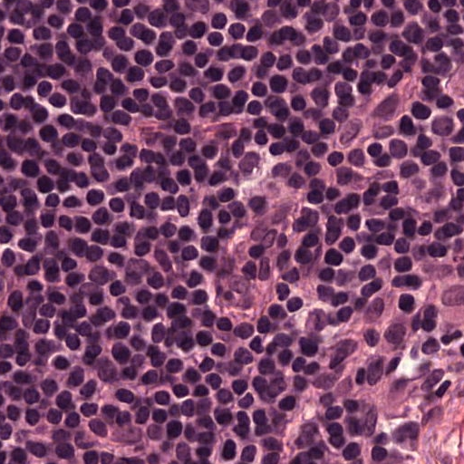
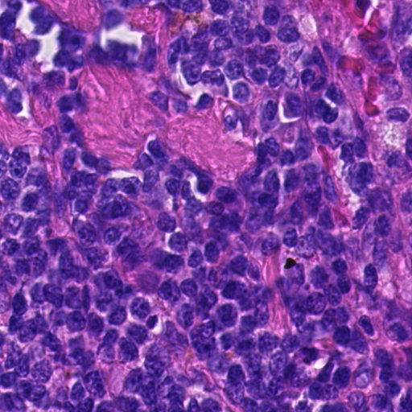
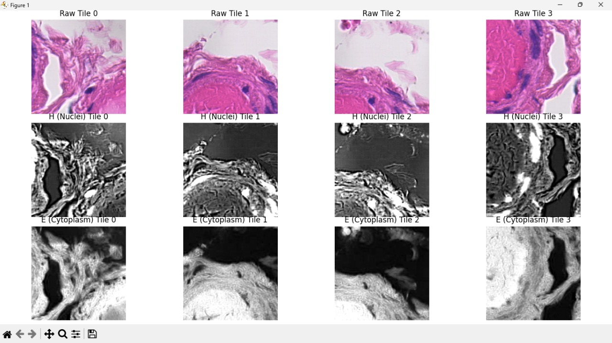
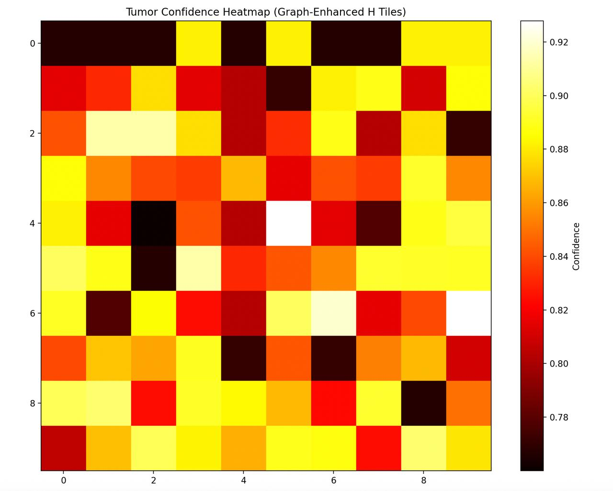

# PathAI Pro — Digital Pathology Analysis Platform


A comprehensive AI-powered digital pathology platform that analyzes whole slide images (WSI) - [3,00,00,00,000 x 3,00,00,00,000 pixels] using deep learning models to detect tumor regions, generate confidence heatmaps, and provide explainable clinical insights for healthcare professionals.

**Developed by Team PathFinders for Fusion SKNCOE Hackathon**

---

## 🚀 Key Features

### 🔬 Advanced AI Analysis
- **Real ML-powered tumor detection** using trained ResNet18 and MobileNet dual model architecture
- **Whole Slide Image (WSI) support** with OpenSlide integration
- **H&E stain deconvolution** for enhanced tissue analysis
- **Tile-based analysis** with confidence scoring per region
- **Mathematical lesion probability calculation**: `P_lesion = (C̄_tumor × R_tumor) + (0.1 × C̄_all)`

### 🖼️ Interactive Visualization
- **WSI Viewer** with zoom, pan, and navigation controls
- **Real-time heatmap overlay** showing tumor confidence regions
- **Mini-map navigation** for large slide exploration
- **Region-based analysis** with bounding box annotations
- **Confidence legend** and analysis metrics display

### 👥 Patient Management
- **Complete patient records** with medical history
- **Case-based organization** with unique case IDs
- **Multi-patient support** with SQLite database
- **Patient data validation** and secure storage

### 🤖 Explainable AI
- **Groq LLaMA integration** for clinical explanations
- **Context-aware insights** based on patient demographics
- **Confidence-based recommendations** (High/Moderate/Low)
- **Clinical correlation suggestions**

### 📊 Comprehensive Reporting
- **PDF report generation** with ReportLab
- **Analysis metrics** and statistical summaries
- **Downloadable reports** with case details
- **Clinical recommendations** based on AI findings

---

## 🛠️ Technology Stack

### Backend (Python)
- **FastAPI** 0.118.2 - Modern async web framework
- **PyTorch** 2.8.0 + **PyTorch Lightning** - Deep learning framework
- **OpenSlide** 4.0.0 - Whole slide image processing
- **SQLAlchemy** 2.0.43 - Database ORM
- **Groq** - LLaMA model integration for AI explanations
- **ReportLab** 4.4.4 - PDF generation
- **scikit-image** 0.25.2 - Image processing utilities
- **OpenCV** 4.12.0.88 - Computer vision operations

### Frontend (TypeScript/React)
- **React** 18.3.1 + **TypeScript** 5.8.3
- **Vite** 5.4.19 - Build tool and dev server
- **Tailwind CSS** 3.4.17 - Utility-first CSS framework
- **Radix UI** - Accessible component primitives
- **TanStack Query** 5.83.0 - Data fetching and caching
- **React Router** 6.30.1 - Client-side routing
- **Lucide React** - Modern icon library

### Machine Learning Pipeline
- **Custom ResNet18 and MobileNet** trained on histopathology data
- **H&E stain deconvolution** using color deconvolution matrix
- **Tissue detection** with Otsu thresholding
- **Tile-based processing** (224x224 patches)
- **Confidence aggregation** with mathematical formulas

---

## 📋 Prerequisites

- **Python** 3.8+ (recommended: 3.10+)
- **Node.js** 16+ (recommended: 18+)
- **npm** or **yarn** package manager
- **CUDA** (optional, for GPU acceleration)
- **Groq API Key** (for AI explanations)

---

## 🚀 Installation & Setup

### 1. Clone Repository
```bash
git clone <repository-url>
cd Digital-Pathology-Image-Analysis-Platform
```

cd backend

# Install uv (one-time)
pip install uv

# Initialize uv project (creates pyproject.toml + uv.lock)
uv init

# Create virtual environment
uv venv

# Activate virtual environment
# Windows:
.venv\Scripts\activate
# macOS/Linux:
source .venv/bin/activate

# Import dependencies from existing requirements.txt (one-time)
uv add -r requirements.txt

# Install dependencies (locked versions)
uv sync

# Set environment variables
export GROQ_API_KEY="your-groq-api-key-here"

# Run the backend server
python main.py


### 2. Backend Setup
```bash
cd backend

# Create virtual environment
python -m venv venv

# Activate virtual environment
# Windows:
venv\Scripts\activate
# macOS/Linux:
source venv/bin/activate

# Install dependencies
pip install -r requirement.txt

# Set environment variables
export GROQ_API_KEY="your-groq-api-key-here"

# Run the backend server
python main.py
```

**Backend will be available at:**
- API Server: http://localhost:8000
- Interactive API Docs: http://localhost:8000/api/docs
- Health Check: http://localhost:8000/api/health

### 3. Frontend Setup
```bash
cd frontend

# Install dependencies
npm install

# Start development server
npm run dev
```

---

## 📁 Project Architecture

```
Digital-Pathology-Image-Analysis-Platform/
├── backend/
│   ├── main.py                 # FastAPI application entry point
│   ├── database.py            # SQLAlchemy database configuration
│   ├── models.py              # Database models (Patient, Analysis, Report)
│   ├── schemas.py             # Pydantic schemas for API validation
│   ├── patient_service.py     # Patient management business logic
│   ├── analysis_service.py    # Image analysis orchestration
│   ├── ai_service.py          # Groq AI integration for explanations
│   ├── report_service.py      # PDF report generation
│   ├── ml_integration.py      # ML model and WSI processing
│   ├── h1preprocess.py        # H&E stain preprocessing utilities
│   ├── requirement.txt        # Python dependencies
│   ├── uploads/               # Uploaded image storage
│   ├── reports/               # Generated PDF reports
│   └── static/                # Static file serving
├── frontend/
│   ├── src/
│   │   ├── components/
│   │   │   ├── ui/            # Radix UI component library
│   │   │   ├── WSIViewer.tsx  # Interactive slide viewer
│   │   │   ├── ConfidenceDisplay.tsx    # Confidence metrics
│   │   │   ├── ExplainabilityPanel.tsx # AI explanations
│   │   │   └── PatientSidebar.tsx      # Patient information
│   │   ├── pages/
│   │   │   ├── Upload.tsx     # Patient creation & image upload
│   │   │   ├── Index.tsx      # Analysis results dashboard
│   │   │   └── NotFound.tsx   # 404 error page
│   │   ├── services/
│   │   │   └── api.ts         # API client and endpoints
│   │   ├── hooks/             # Custom React hooks
│   │   ├── lib/               # Utility functions
│   │   └── App.tsx            # Main application component
│   ├── public/
│   │   └── tumor_heatmap.png  # Sample heatmap visualization
│   ├── package.json           # Node.js dependencies
│   ├── tailwind.config.ts     # Tailwind CSS configuration
│   ├── vite.config.ts         # Vite build configuration
│   └── components.json        # shadcn/ui configuration
├── LICENSE                    # Apache 2.0 License
└── README.md                  # This file
```

---

## 🔌 API Endpoints

### Patient Management
| Method | Endpoint | Description |
|--------|----------|-------------|
| POST | `/api/patients/` | Create new patient record |
| GET | `/api/patients/` | List all patients (paginated) |
| GET | `/api/patients/{id}` | Get specific patient details |
| PUT | `/api/patients/{id}` | Update patient information |
| DELETE | `/api/patients/{id}` | Delete patient record |

### Image Analysis
| Method | Endpoint | Description |
|--------|----------|-------------|
| POST | `/api/analyze/{patient_id}` | Upload image and run ML analysis |

**Analysis Response includes:**
- Lesion probability percentage
- Overall confidence score
- Confidence level (High/Moderate/Low)
- High-probability regions with bounding boxes
- Detailed metrics (tiles analyzed, tumor tiles, etc.)
- Heatmap data for visualization
- AI-generated clinical insights

### AI Explanations
| Method | Endpoint | Description |
|--------|----------|-------------|
| POST | `/api/explain` | Generate AI explanation for analysis results |

### Report Generation
| Method | Endpoint | Description |
|--------|----------|-------------|
| POST | `/api/reports/` | Generate PDF clinical report |
| GET | `/api/reports/{id}` | Download generated report |
| GET | `/api/patients/{patient_id}/reports` | Get all reports for patient |

### System
| Method | Endpoint | Description |
|--------|----------|-------------|
| GET | `/api/health` | System health check |
| GET | `/api/docs` | Interactive API documentation |

---

## 🔬 ML Analysis Pipeline

### 1. Image Processing
- **WSI Loading**: OpenSlide integration for .tif, .svs, .ndpi files
- **Tissue Detection**: Otsu thresholding on low-resolution thumbnail
- **Tile Extraction**: 224x224 pixel patches from tissue regions
- **H&E Deconvolution**: Separate hematoxylin and eosin channels

### 2. Deep Learning Inference
- **Model**: Custom ResNet18 trained on histopathology data
- **Input**: H&E deconvolved tissue patches
- **Output**: Tumor/Normal classification with confidence scores
- **Batch Processing**: Efficient GPU utilization for multiple tiles

### 3. Results Aggregation
- **Lesion Probability**: `P_lesion = (C̄_tumor × R_tumor) + (0.1 × C̄_all)`
- **Confidence Levels**: High (≥75%), Moderate (50-74%), Low (<50%)
- **Region Detection**: Top 5 highest confidence tumor regions
- **Heatmap Generation**: Spatial visualization of predictions

### 4. Clinical Integration
- **Patient Context**: Age, gender, medical history consideration
- **AI Explanations**: Groq LLaMA-powered clinical insights
- **Recommendations**: Confidence-based next steps

---

##  Results

### 🧫 Sample Tissue Images in WSI
Below are sample tiles extracted from the WSI image for ML Pipeline Processing.

<p align="center">
  
  
</p>

<p align="center">
  <em>Left: Normal Tissue | Right: Tumor Tissue</em>
</p>

---

### 🧬 H&E Stain Deconvolution
Below are visual results showing **Raw Tiles**, **H (Nuclei)**, and **E (Cytoplasm)** channels extracted during the deconvolution process.



### 🔥 Tumor Confidence Heatmap
This heatmap shows the **model’s confidence distribution** across H&E-stained tiles.  
Regions in bright yellow indicate higher tumor probability.



---


## 📊 Usage Workflow

### 1. Patient Registration
1. Navigate to the Upload page
2. Fill in patient information (name, age, gender, medical history)
3. Create patient record

### 2. Image Analysis
1. Upload pathology image (JPEG, PNG, TIFF formats supported)
2. System automatically processes the image using ML pipeline
3. View real-time analysis progress

### 3. Results Visualization
1. Interactive WSI viewer with zoom/pan controls
2. Toggle between original image and confidence heatmap
3. Explore high-probability tumor regions
4. Review detailed analysis metrics

### 4. AI Insights
1. Read AI-generated clinical explanations
2. Review confidence-based recommendations
3. Consider patient-specific context

### 5. Report Generation
1. Generate comprehensive PDF reports
2. Download for clinical documentation
3. Include analysis metrics and recommendations

---

## 🔧 Configuration

### Environment Variables
```bash
# Backend
GROQ_API_KEY=your-groq-api-key
DATABASE_URL=sqlite:///./pathology.db
UPLOADS_DIR=./uploads
REPORTS_DIR=./reports

# Frontend
VITE_API_BASE_URL=http://localhost:8000
```

### Model Configuration
- **Model Path**: `backend/resnet18.ckpt`
- **Tile Size**: 224x224 pixels
- **Tissue Threshold**: 30% tissue content
- **Max Tiles**: 1000 per analysis (performance limit)

---

## 🤝 Contributing

We welcome contributions! Please see our contributing guidelines:

1. Fork the repository
2. Create a feature branch (`git checkout -b feature/amazing-feature`)
3. Commit your changes (`git commit -m 'Add amazing feature'`)
4. Push to the branch (`git push origin feature/amazing-feature`)
5. Open a Pull Request

---

## 📄 License

This project is licensed under the Apache License 2.0 - see the [LICENSE](LICENSE) file for details.

---

For technical support or questions:
- Check the [API Documentation](http://localhost:8000/api/docs)
- Review backend logs for detailed error information
- Use browser developer tools for frontend debugging

---

**Last Updated**: January 2026  
**Version**: 2.0.0  
**Status**: Active Development
